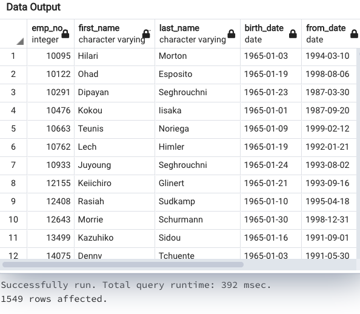

# Pewlett-Hackard-Analysis
## Overview:

In this project we were given thousands of  date from a company, Pewlett-Hackard,on their employees. Unfortunately, their older employees are soon to be retiring, and it was our job to find how many are retiring, and how many job position will need to be filled. Due to the number of retirees it became worrisome for the company to have that many suddenly leave, they terming this event as the "Silver Tsunami". In order for us to find us to find this information, we were given the year of births that corresponds to the employees that will retire.The employees that are retiring from the company were born in the years of 1952-1955, we were able to use all the data from CSV spreadsheets and narrow down the amount of retirees and their positions using SQL to create new tables that convey the information needed from the company.

## Results:

* The amount of retirees that will leave will be approximately over 72,000. This can be seen in the retiring title table shown below. 

* The titles that are held by upcoming retirees that will be the most affected are the senior engineers and senior staff members, as both of these roles will lose 50,842 employees combined. This can be seen in the table below. 

* The least affected role in this "Silver Tsunami" is the Manager roles, as there are only two employees who hold that role and will retire.This can also be seen in the table above. 
* The amount of eligible mentors are only 1549 employees. Which may not be enough to train the next generation. This can be seen in the table below.

# Analysis:

